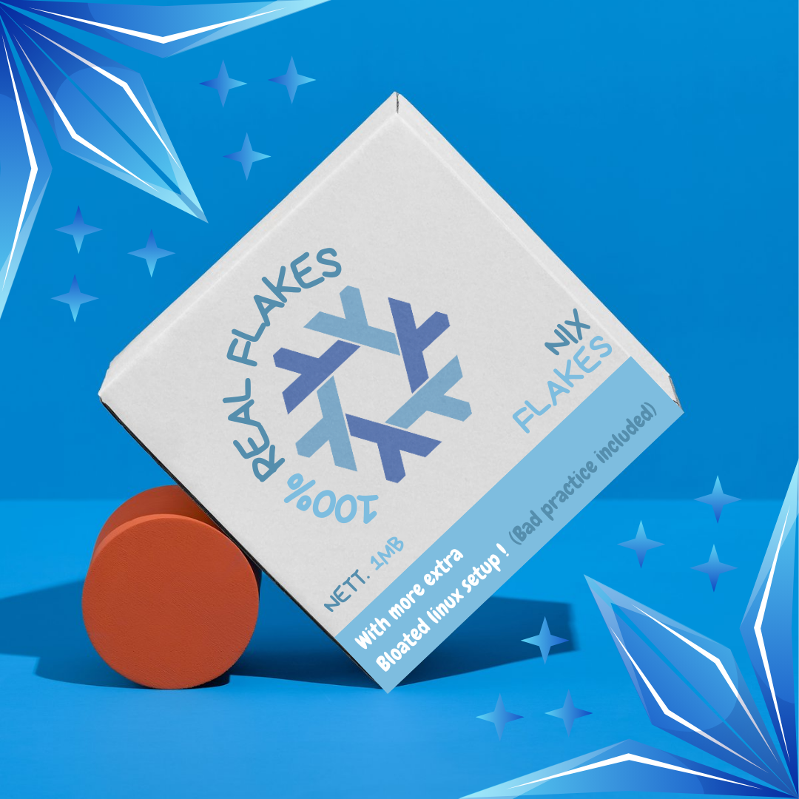

# Not So Sweet Flakes Cereal
Version control of my personal NixOS config
Using
- Home manager
- Flake
- Mate DE

## Version Numbering
| Info | Version | Revision | Device |
|------|---------|----------|--------|
| Example | V1 | R30 | HP14s |

> R30 meant its the 30th revision for the version that on the
> version numbering. (V1)

## Program list
You can check out the progrma list [here](stuff/list.md)

